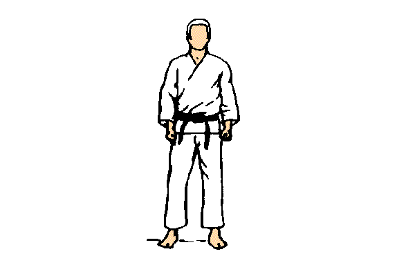

# Clases 2019

## Próxima clase (miércoles 20/03)

### Presentación de la materia y de los profesores

- Somos un grupo de docentes que va a dictar una cursada homogénea en ambos cursos, nos vamos a ir rotando para que conozcan a todos. Nos presentamos.
- Como "Las personas son importantes y hacen la diferencia", es fundamental tener una buena relación con nosotros, que se sientan libres de venir a consultarnos temas académicos e incluso personales o laborales. Nuestro objetivo es que ustedes se sientan cómodos en la cursada, y nosotros también. Por eso creemos que el trato amable y distendido ayuda a que todo fluya mejor, siempre teniendo en cuenta que todos somos personas, tenemos sentimientos y merecemos ser tratados con respeto.
- Punto de entrada: http://pdep.com.ar y de ahí tenemos nuestra página de los miércoles a la noche (sí, una sola)
- El horario, de 19 a 22:20, y quizás nos extendamos las primeras clases un poco más hasta que alcancen ritmo con la ejercitación obligatoria
- La materia necesita un ida y vuelta constante y vamos a pedir que le dediquen 4 horas por semana, quizás noten cierta "intensidad" nuestra pero el día de mañana nos lo van a agradecer
- Paradigmas y tecnologías: es fundamental complementar la teoría con práctica
- Evaluación práctica: katas y trabajos prácticos
- Parciales y recuperatorios: **lean las reglas de juego** para poder presentarse a los parciales.
- Régimen de promoción: 8 ó más de ocho en cada uno de los parciales y el scoring de las katas en los tres paradigmas ok.
- Seguimiento de clases mediante esta página
- Grupo de la materia (pdep-mn@googlegroups.com), hay que actualizar **cuanto antes** tus datos en la lista del [curso K2052](https://docs.google.com/spreadsheets/d/1h3zS_0IiAgVzw2p-A2X4dVUgVcDozZVXQXGN4hES3Qg/edit) o [la del K2152](https://docs.google.com/spreadsheets/d/1jRJOhhPgLrPJniDmLZSvspT36MKfA8WwAs0SEI1Rb7M/edit#gid=0)
- IMPORTANTE: Reglas de etiqueta para la comunicación
  - la lista es para temas administrativos, anuncios importantes (ej: paro de colectivos o docente, situaciones de emergencia de algún docente), para problemas al configurar el entorno, para dudas puntuales sobre conceptos o ejercicios que no tengan que ver con el TP. **Para el TP estarán los tutores**.
  - si tienen un inconveniente, no respondan sobre el último mail de la lista que se haya enviado. Por ejemplo, tengo un problema al instalar Haskell en Mac y para escribir a la lista mi problema respondo un mail sobre "Duda sobre cómo utilizar la consola en GHCi". Esto pisa la pregunta de su compañero, y además confunde a quien quiere responder.
  - Firmen siempre que manden un mail. Es imprescindible que sepamos con quién estamos hablando, especialmente si sacaron una casilla como `put@elquelee@gmail.com`
  - **No manden mails privados a docentes por consultas que no sean del TP**. Si el docente no puede contestar, se quedaron sin respuesta. Si el docente contesta, solo ustedes pueden aprovechar esa respuesta y no les sirve a otros. Si mandan el mail a la lista, cualquiera tiene la potestad de contestar, y si hay algo que corregir o consensuar es mucho más fácil.
  - Si arman un grupo para el TP, manden mail a los tutores y copien siempre a sus compañeros, para que todos estén al tanto de las preguntas y las respuestas.
- Herramientas: [Mumuki](https://mumuki.io/home/), la lista pdep-mn, los links a las clases de esta página, el Software que podés descargarte y para el TP tus tutores.
- Una aclaración desde el vamos: _"programar no es lo que era antes"_, y en ese tono los trabajos prácticos y las katas requerirán temas que exceden a simplemente escribir código: preparar casos de prueba e implementarlos, utilizar herramientas colaborativas entre tus compañeros, son algunos de esos requisitos que vamos a pedir.

### Contenidos teóricos

- [Integración de conceptos - Charla inicial de la materia](https://docs.google.com/document/d/1QP1ftd6jvAlVZOAsVPJ_1I0O7WW9MaIrn6zfW-iJdrY/edit)
- [Módulo 1 Funcional: Introducción al paradigma](https://docs.google.com/document/d/1W5BcOmIJMCylqAjqPw1RzPlujycbvNJueh8-Uyc2fMY/edit?usp=sharing)

### Tarea para el hogar

¡Se vienen las katas! Para lo cual la semana que viene tenés que

- [Instalar el entorno Haskell](./haskell/entorno.md), si tenés problemas revisá la [página de troubleshooting](./haskell/troubleshooting.md) o bien mandá un mail a la lista
- Jugá un poco con Haskell [creando un proyecto desde cero](./haskell/nuevoProyecto.md)
- [Leer el objetivo de las katas](./katas.md)
- Van a trabajar de a pares, pero no hace falta "armar grupos", lo haremos en el momento. En cada kata podés trabajar con alguien diferente.

## Links útiles

- [Clases 2018](https://sites.google.com/site/paradigmasdeprogramacion/Cursos/cursadas-anteriores/2018/2018-noc-miercoles/seguimiento-clase-2018)
- [Curso 1 Miércoles a la noche 2018](https://sites.google.com/site/paradigmasdeprogramacion/Cursos/cursadas-anteriores/2018/2018-noc-miercoles), por si necesitas datos como libro o folio
