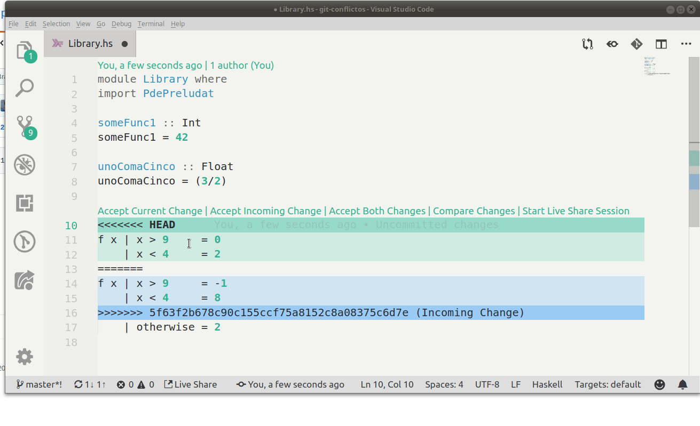

# Resolución de conflictos en Git

Cuando hacemos un trabajo en conjunto, es común que dos o más personas trabajen en forma individual en sus propias máquinas, ubicados en distintos puntos geográficos. Por lo tanto, es muy frecuente que cuando intentemos hacer push sobre un repositorio Git nos encontremos con un mensaje como el siguiente:

```bash
$ git push
Username for 'https://github.com': fdodino
Password for 'https://fdodino@github.com': 
To https://github.com/pdep-utn/git-conflictos
 ! [rejected]        master -> master (fetch first)
error: failed to push some refs to 'https://github.com/pdep-utn/git-conflictos'
hint: Updates were rejected because the remote contains work that you do
hint: not have locally. This is usually caused by another repository pushing
hint: to the same ref. You may want to first integrate the remote changes
hint: (e.g., 'git pull ...') before pushing again.
hint: See the 'Note about fast-forwards' in 'git push --help' for details.
```

Esto significa que **alguien hizo cambios y los subió al repositorio remoto**, por lo que nuestro repositorio local quedó desactualizado. 

TODO: Gráfico

## Traer los cambios del repositorio remoto

Como bien dijo el _hint_ de la línea de comando, debemos hacer la operación **pull** para traer los datos del repositorio remoto a nuestro repositorio local (y además los bajará a los archivos del _file system_):

```bash
git pull
remote: Enumerating objects: 7, done.
remote: Counting objects: 100% (7/7), done.
remote: Compressing objects: 100% (3/3), done.
remote: Total 4 (delta 2), reused 0 (delta 0), pack-reused 0
Unpacking objects: 100% (4/4), done.
From https://github.com/pdep-utn/git-conflictos
   1a3d88e..5f63f2b  master     -> origin/master
Auto-merging src/Library.hs
CONFLICT (content): Merge conflict in src/Library.hs
Automatic merge failed; fix conflicts and then commit the result.
```

Al sincronizar los repositorios, Git intentará actualizar los archivos que tienen modificaciones desde el último commit en el repositorio local. Aquí puede pasar

- que las actualizaciones no tengan conflictos con el código modificado por nosotros
- o que por el contrario haya cambios en la misma línea, por lo que el _merge_ no puede hacerse automáticamente. En ese caso nos aparecerá la palabra CONFLICT y el archivo a continuación.

## Solucionar los conflictos

En Visual Studio Code, veremos que el archivo fue modificado por git. En cada conflicto verán:

- con `<<<<<` lo que nosotros tenemos en nuestra máquina
- con `>>>>>` lo que está subido al repositorio remoto
- para separar ambos cambios tendrán una línea con `=======`



Visual Studio Code les permite

- aceptar los cambios de ustedes ("Accept Current Change"), esto resuelve los conflictos pisando los cambios remotos con nuestra versión
- aceptar los cambios remotos ("Accept Incoming Change"), esto resuelve los conflictos pisando los cambios locales con la versión remota
- abrir una ventana de comparación
- y más allá de las otras opciones, podés editar manualmente el archivo (tendrás que borrar las líneas con `<<<<<`, `======` y `>>>>>` y ajustar lo que sea necesario)

## Subir los cambios al repositorio remoto

Una vez que corrimos los tests y pasan, la operatoria es idéntica:

```bash
git add  # -p si queremos ver los cambios
git commit -m "Arreglo de conflictos"  # o un mensaje representativo
git push
```

Recordá que podés hacer

```
git status
```

para ver el estado actual de tu repositorio git.


