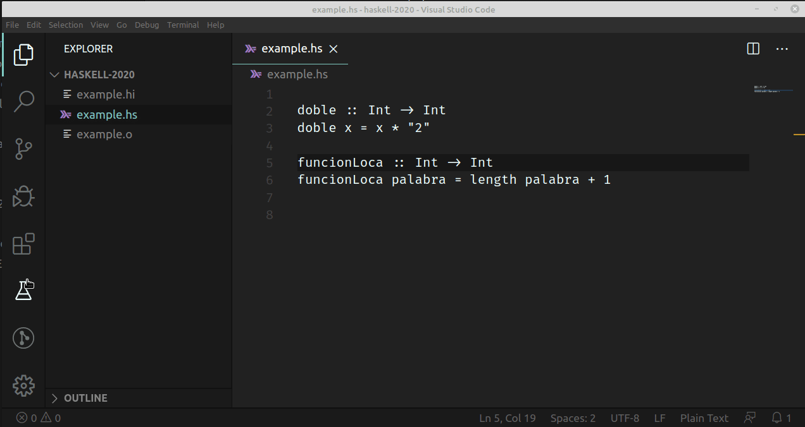
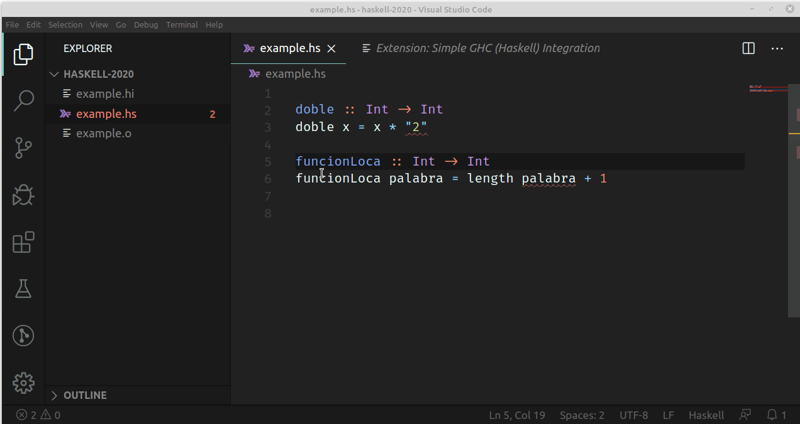

# Instalación y configuración del entorno Haskell

Esta página te ayudará a instalar y configurar el entorno Haskell para realizar todas las prácticas del **paradigma funcional** para los cursos del miércoles a la noche.

Seguir estas instrucciones no es obligatorio para hacer las _katas_ o el trabajo práctico, no obstante tené en cuenta que no vamos a dar soporte de otras tecnologías (son muchas y se vuelve muy difícil lograr que funcionen para todas las máquinas y sistemas operativos). Si tu intención es arreglarte con un _notepad_ asegurate que pase todos los controles necesarios que pide cada enunciado (más adelante los irás conociendo).

> **Nota importante:** respetá el orden de instalación de las cosas, porque algunos componentes necesitan que otros estén previamente instalados.

## Stack

**Stack** es un conjunto de herramientas que facilita enormemente el desarrollo comercial y académico en Haskell. Se instala siguiendo [estos pasos](https://docs.haskellstack.org/en/stable/README/#how-to-install): elegí el que corresponda para tu sistema operativo.

> Con la instalación de Stack **no es necesario instalar el compilador de Haskell**, de hecho desaconsejamos su instalación.

## Editor de texto

Existen [muchas opciones](https://wiki.haskell.org/IDEs), nosotros te recomendamos [Visual Studio Code](https://code.visualstudio.com/)

### Plugins necesarios

Para mejorar nuestra experiencia de Haskell con Visual Studio Code, se deben instalar los siguientes plugins:

- [**Simple GHC (Haskell) Integration**](https://github.com/dramforever/vscode-ghc-simple) de dramforever
- **Haskutil**, de Eduard Sergeev, que te puede ayudar con los imports de funciones externas.
- **Markdown All in One**, para leer los enunciados con el formato [Markdown](https://help.github.com/articles/basic-writing-and-formatting-syntax/)
- **GitLens**, para integrar Git con Visual Studio

Si querés ver cómo se instalan los plugins en Visual Studio Code, podés ver este video que muestra cómo se instala el plugin principal de Haskell



Al final de la instalación, podés ver las extensiones de Haskell instaladas buscando en la solapa Extensions:

```bash
@installed Haskell
```

o simplemente `@installed` para verificar que seguiste los mismos pasos con los demás plugins.

### Plugins opcionales

Si te gustó el font que dibuja la igualdad y las flechas con signos más bonitos, te recomendamos que instales el font [Fira Code](https://github.com/tonsky/FiraCode) (seguí las instrucciones del repositorio).

Y un detalle más: podés descargarte temas para Visual Studio Code que modifiquen los colores con los que se marcan las variables, los nombres de las funciones, los números, los strings, etc. En la solapa Extensions podés buscar `Themes` y te aparecerá una larga lista para que elijas la que más te gusta.

## Entorno completo

Si todo quedó correctamente instalado, vas a tener un entorno integrado con el código que vayas escribiendo, como te muestra este video



Desplegando el menú `View > Problems (Ctrl + Shift + M)` tenés acceso a todos los errores y advertencias que tiene tu archivo `.hs`. Al hacer click sobre un problema te lleva directamente a la línea que origina el inconveniente.

Si tenés algún error, te recomendamos visitar la página [troubleshooting para ayudarte a resolver errores posibles en la instalación de Haskell](./troubleshooting.md)

> Es super importante que puedas contar con un entorno integrado, y que no tengas que escribir el código "a ciegas" para luego compilarlo en una especie de big bang que te fuerce a mirar todos los errores de una. No es una experiencia de usuario recomendable, sobre todo en Haskell...

## Git

Luego necesitarás instalar Git para descargar o subir tu código al hacer las prácticas (y también te servirá para trabajar en conjunto). Te dejamos el [link para descargar Git](https://git-scm.com/downloads) (elegí el que corresponda a tu sistema operativo)

## Video introductorio

Te dejamos un [tutorial que explica cómo se trabaja en Haskell con el Visual Studio Code](https://www.youtube.com/watch?v=xLsg-xk3tlg&feature=youtu.be)
