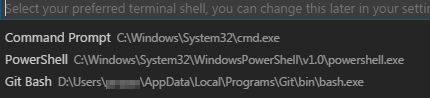
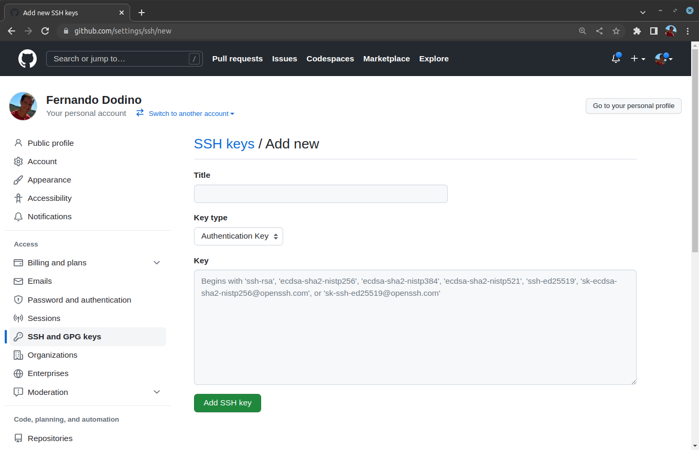
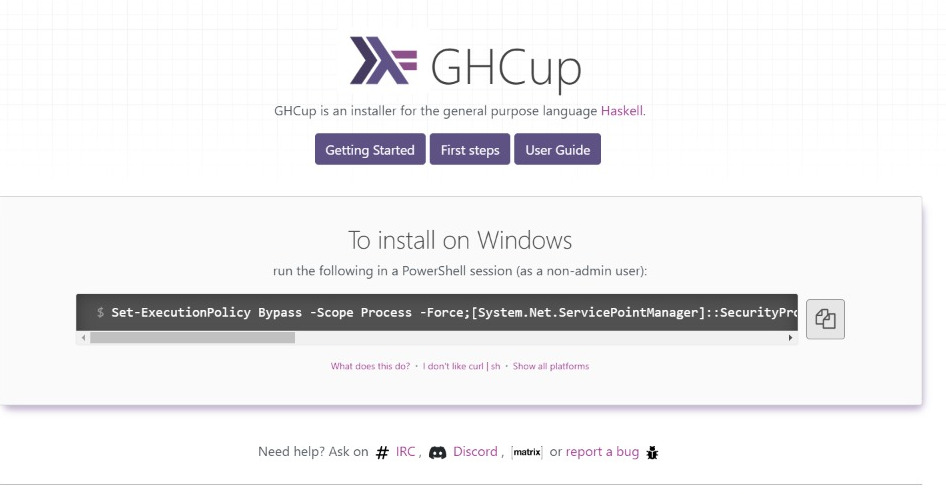
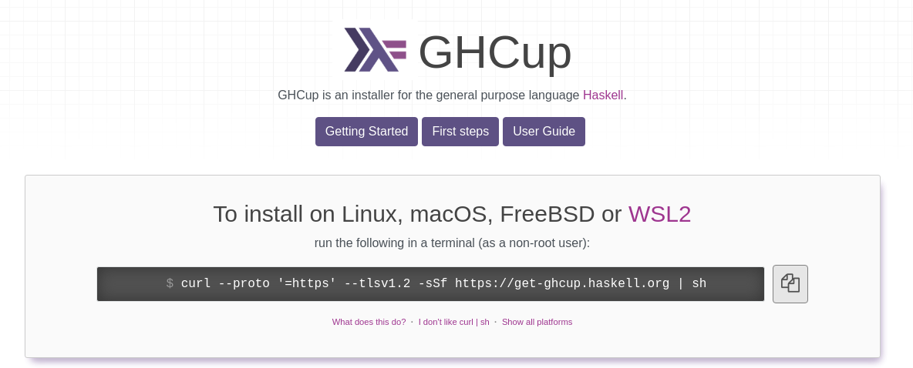
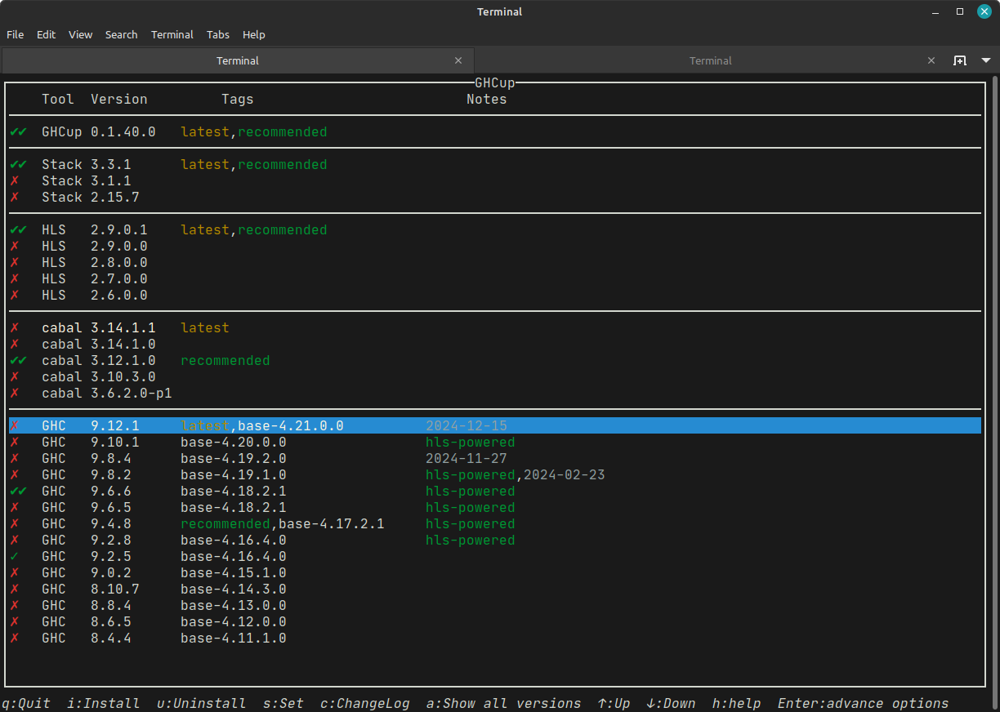
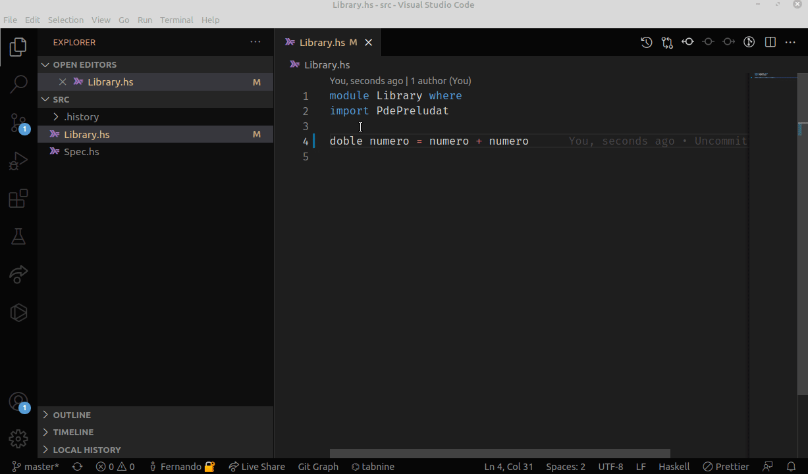
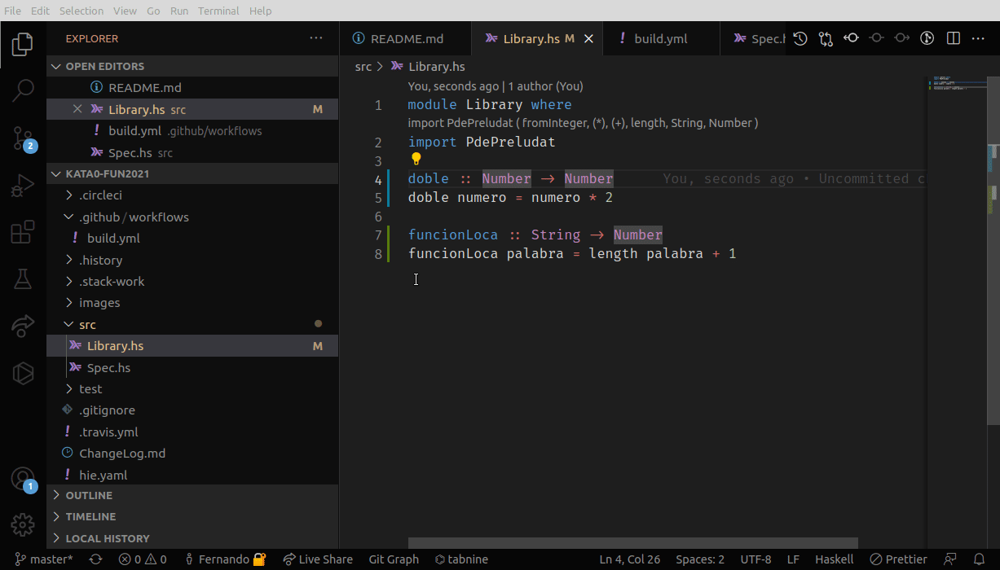

# Instalación y configuración del entorno Haskell

Esta página te ayudará a instalar y configurar el entorno Haskell para realizar todas las prácticas del **paradigma funcional** para los cursos del miércoles a la noche, necesario para hacer las _katas_ o el trabajo práctico. 

> **Nota importante:** respetá el orden de instalación de las cosas, porque algunos componentes necesitan que otros estén previamente instalados.

## Git

Primero que nada necesitarás instalar Git para versionar y subir tu código al hacer las prácticas (también te servirá para trabajar en conjunto). Te dejamos el [link para descargar Git](https://git-scm.com/downloads) (elegí el que corresponda a tu sistema operativo).

### Git en Windows

Si estás en Windows, necesitás descargar [Git Bash](https://gitforwindows.org/). **Cada vez que requieras hacer algo por línea de comando, tenés que usar Git Bash y no Power Shell/CMD**. En la solapa Terminal de Visual Studio Code teneś que cambiar la configuración de tu shell para usar Git Bash:


Luego en la lista de opciones, seleccioná Git Bash:



Podés ver [este excelente video-tutorial de Franco Esposta](https://www.youtube.com/watch?v=rRKe7l-ZNvM) al respecto.

### Configuración de usuario Git

La primera vez que estés usando git en tu computadora, tenés que definir tu usuario de github y tu mail. Lo hacés desde una terminal cualquiera:

```bash
git config --global user.name "XXXXXXX"  # reemplazar XXXXXXX por tu nombre de usuario
git config --global user.email x@yyy.zzz # reemplazar x@yyy.zzz por tu mail
```

Podés chequear que todo quedó bien configurado escribiendo

```bash
git config --list
```

### Git con SSH

Vamos a configurar SSH (Secure Shell), el protocolo de red que evita que tengas que poner una contraseña cada vez que quieras bajar o subir tu código a la nube. Para eso una vez que instalamos Git, nos vamos a una terminal (común o si es Windows utilizaremos Git Bash), y escribimos:

```bash
ssh-keygen -t rsa -b 4096 -C x@yyy.zzz # reemplazar x@yyy.zzz por tu mail de github
```

En el GIF podemos ver cómo se genera la clave SSH paso a paso:


> ATENCIÓN: Elegí una passphrase a tu gusto. A medida que la ingreses, no verás lo que escribís, pero quedará registrada.

y por último escribimos los siguientes comandos:

```bash
eval "$(ssh-agent -s)"
ssh-add ~/.ssh/id_rsa
```

Esto nos generó un par de claves, la pública que vamos a asociar a nuestra cuenta de github y la privada que solo debemos dejarla en nuestra computadora, sin compartirla con nadie. Luego hay que copiar en el portapapeles el contenido de la clave pública, en Windows es

```bash
clip < ~/.ssh/id_rsa.pub
```

En Mac es 

```bash
pbcopy < ~/.ssh/id_rsa.pub
```

En Linux es

```bash
# puede que tengas que instalar previamente  xclip
# sudo apt-get install xclip
cat ~/.ssh/id_rsa.pub | xclip -selection clipboard
```

Para pegarlo, vas a tu usuario de github: https://github.com/settings/keys y en la Solapa "SSH and GPG Keys" agregan una nueva "SSH Key". El título que le ponen es indistinto, pero tiene que servir para identificar la clave, seleccionan "Authentication Key" y por último pegan del portapapeles la clave pública. Presionan el botón "Add SSH key" y listo.




## ghcup

Si tenés una instalación anterior de **Stack, tenés que eliminarla** siguiendo [estos pasos](https://docs.haskellstack.org/en/v1.9.1/README/#how-to-uninstall).

Si estás en Linux o Mac te conviene instalar estas dependencias:

```bash
sudo apt-get install libgmp3-dev
```

**ghcup** es un conjunto de herramientas estándar que facilita enormemente el desarrollo comercial y académico en Haskell. Se instala [ingresando a esta página](https://www.haskell.org/ghcup/), donde copiás y pegás en una terminal el comando que te propone (está basado en el sistema operativo que vos tengas). Por ejemplo en Windows vas a verlo así:



> ATENCIÓN: el script de instalación está pensado para ejecutarse en Powershell, no en Git Bash

Mientras que en Linux-based lo vas a ver así:



Seleccioná **todas las herramientas que te propone**, incluyendo

- **stack**: la herramienta con la que vamos a automatizar tareas
- **cabal**: el manejador de dependencias que utiliza internamente stack
- **HLS** o Haskell Language Server, que ofrece servicios importantes para Visual Studio Code
- y cualquier otro software que te ofrezca

### Chequeo de la instalación de ghcup

Una vez que hayas instalado ghcup, podés comprobar las versiones de las herramientas que instalaste escribiendo en una terminal

```bash
ghcup tui
```

que debería mostrarte una pantalla como la siguiente:



### Comandos manuales de ghcup

ghcup permite que vos le instales versiones diferentes de GHC, Cabal, stack y HLS. Para eso te recomendamos que utilices la versión gráfica `ghcup tui`. Si sos de utilizar la consola o tenés algún inconveniente con la versión gráfica podés utilizar estos comandos:

```bash
ghcup list                  # lista los programas instalados
ghcup install hls 2.7.0.0   # instala una versión específica del componente Haskell Language Server
ghcup set hls 2.7.0.0       # hace que por defecto utilices esa versión de HLS
ghcup upgrade               # actualiza la versión de ghcup
ghcup help                  # ayuda de ghcup
```

### Versiones a instalar

Para el año 2025 éstas son las versiones que vamos a utilizar para cada uno de los componentes. **Chequeá que tengas esas versiones** y si no las tenés recordá que lo instalás mediante el comando `ghcup install nombre_de_componente numero_de_version` como se explica más arriba.

- GHCUP: 0.1.40.0
- HLS (Haskell Language Server): 2.9.0.1
- GHC: 9.6.6
- Stack: 3.3.1
- Cabal: 3.12.1.0

## Editor de texto

Existen [muchas opciones](https://wiki.haskell.org/IDEs), nosotros te recomendamos [Visual Studio Code](https://code.visualstudio.com/)

### Plugins necesarios

Para mejorar nuestra experiencia de Haskell con Visual Studio Code, se deben instalar los siguientes plugins:

- **Haskell**, de Haskell: Haskell language support powered by the Haskell Language Server
- **Haskell Syntax Highlighting**, de Justus Adam: Syntax support for the Haskell programming language.
- **Markdown All in One**, para leer los enunciados con el formato [Markdown](https://help.github.com/articles/basic-writing-and-formatting-syntax/)
- **Git Extension Pack**, para integrar Git con Visual Studio
- Recomendamos también instalar el extension **Live Share** (ms-vsliveshare.vsliveshare), con el que pueden no solo compartir sino también interactuar con sus compañer@s y tutores (todos pueden escribir en el mismo espacio de trabajo).

Si querés ver cómo se instalan los plugins en Visual Studio Code, podés ver este video que muestra cómo se instala el plugin principal de Haskell



Fijate por ejemplo que el plugin aprovecha los tipos que infiere Haskell y con un simple click te permite escribirlo en tu código. Al final de la instalación, podés ver las extensiones de Haskell instaladas buscando en la solapa Extensions:

```bash
@installed Haskell
```

o simplemente `@installed` para verificar que seguiste los mismos pasos con los demás plugins.

### Plugins opcionales

- **hoogle-vscode** (jcanero.hoogle-vscode): podés buscar funciones estándar de Haskell

Si te gustó el font que dibuja la igualdad y las flechas con signos más bonitos, te recomendamos que instales el font [Fira Code](https://github.com/tonsky/FiraCode) (seguí las instrucciones del repositorio).

Y un detalle más: podés descargarte temas para Visual Studio Code que modifiquen los colores con los que se marcan las variables, los nombres de las funciones, los números, los strings, etc. En la solapa Extensions podés buscar `Themes` y te aparecerá una larga lista para que elijas la que más te gusta.

## Crear un primer proyecto

Te recomendamos que sigas [estas instrucciones](./nuevoProyecto.md) para crear tu primer proyecto.

## Entorno completo

Si todo quedó correctamente instalado, vas a tener un entorno integrado con el código que vayas escribiendo, como te muestra este video



Desplegando el menú `View > Problems (Ctrl + Shift + M)` tenés acceso a todos los errores y advertencias que tiene tu archivo `.hs`. Al hacer click sobre un problema te lleva directamente a la línea que origina el inconveniente.

Si tenés algún error, te recomendamos visitar la página [troubleshooting para ayudarte a resolver errores posibles en la instalación de Haskell](./troubleshooting.md)

> Es super importante que puedas contar con un entorno integrado, y que no tengas que escribir el código "a ciegas" para luego compilarlo en una especie de big bang que te fuerce a mirar todos los errores de una. No es una experiencia de usuario recomendable, sobre todo en Haskell...

## Video introductorio

Te dejamos un [tutorial que explica cómo se trabaja en Haskell con el Visual Studio Code](https://youtu.be/aTXvOl_lrqQ).
