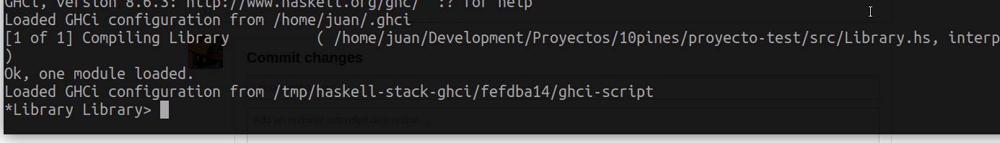
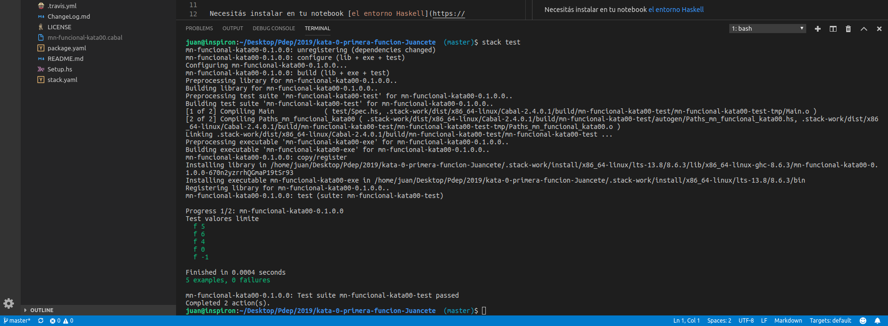

# Esquema de trabajo en el entorno Haskell

## Pruebas manuales

Tenemos la posibilidad de abrir un terminal del sistema operativo dentro de VSCode yendo al menú _Terminal -> nuevo terminal_, o bien abrir un terminal nativo del sistema. Allí podremos llamar a nuestro intérprete de Haskell (Ghci) mediante el comando

```bash
stack ghci
```

Y podemos jugar con nuestra función/es desarrolladas en el archivo `src/Library.hs`:


### Comandos útiles

> **IMPORTANTE:** Cuando modificamos el archivo en Visual Studio Code, para que la consola tome esos cambios debemos ingresar el comando `:r`

Otros comandos una vez que ingresaste a GHCi:

- `:r` ==> recarga el intérprete de Haskell. Usalo si cambiaste cosas en los archivos y no los ves reflejados en el intérprete.
- `:q` ==> salís del intérprete de Haskell
- `:h` ==> muestra la ayuda de los comandos existentes
- `:t expresión` ==> permite ver la definición de tipos de una expresión. Por ejemplo: `:t length` o `:t (1 +)`
- `:i definición` ==> permite ver la información asociada a un tipo/conjunto de tipos. Por ejemplo: `:i Int` o `:i Num`
- `:set prompt "> "` ==> cambia el "prompt" de la consola por "> ", si en vez de eso escribís cualquier otro string, lo cambia por el string que escribiste.



## Pruebas automatizadas

Los tests están en el archivo `Spec.hs` de la carpeta `test`. Editá ese archivo y cuando esté listo se pueden correr los tests usando:

```bash
stack clean # con --full forzás a eliminar todos los archivos
stack test
```

El comando `stack clean` previo sirve a partir de la segunda vez (cuando hagas cambios a los archivos).



Aquí podemos ver de forma visual si nuestro desarrollo cumple con los requisitos esperados que fueron modelados mediante una batería de tests. Como se puede ver en la imágen anterior al estar todos los tests en verde tenemos la seguridad que la funcionalidad es correcta. En caso de tener un error nos muestra detalladamente cual es la falla:


Si querés podés correr el comando

```bash
stack test --file-watch
```

que ejecuta los tests y se queda esperando **cualquier cambio que hagas en los archivos** para volver a ejecutarlos.
