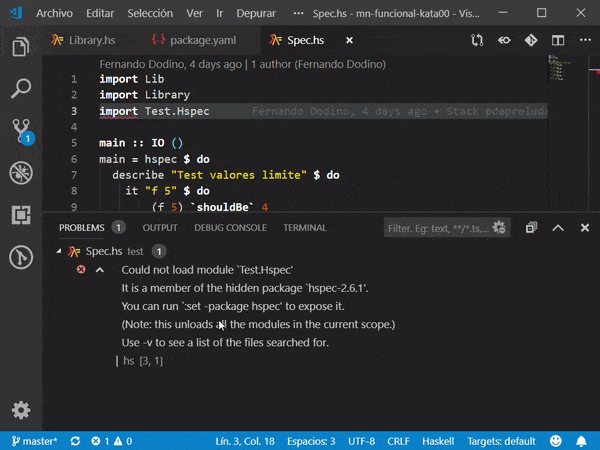
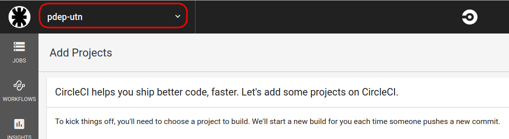
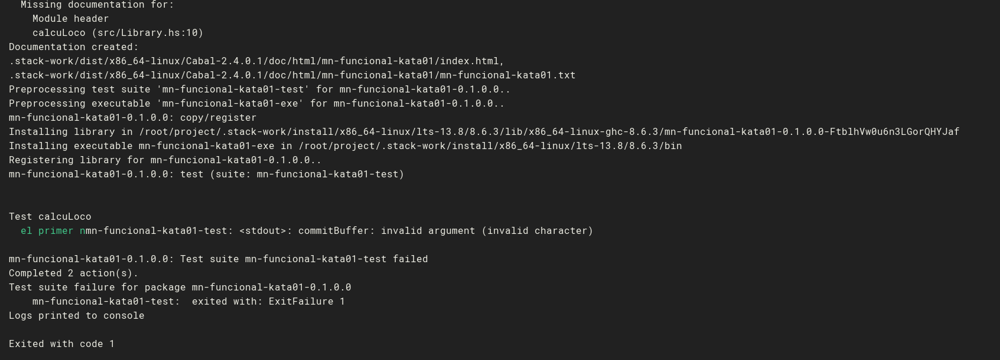

# Troubleshooting Entorno Haskell

## Stack / Haskell

### Al ejecutar el comando stack recibo un mensaje de error

Si ejecutás este comando

```bash
stack new proyecto-test https://raw.githubusercontent.com/10Pines/pdepreludat/master/pdepreludat.hsfiles
```

y recibís un mensaje de error, revisá la versión de stack que tenés instalada (siempre en la consola o en el Git Bash).

```bash
stack --version
```

Deberías ver la versión 1.9.3 ó superior, si tenés una versión anterior ejecutá el siguiente comando:

```bash
stack upgrade
```

De esta manera tendrás la última versión de stack instalada en tu máquina.

### Permission denied al ejecutar un comando stack en Windows

Si al intentar ejecutar `stack build`, `stack test` o cualquier otro comando stack te aparece un mensaje de error del tipo `Permission denied`


**revisá si está corriendo de fondo tu antivirus de Windows**, si es así deshabilitalo o configurá para que no haga chequeos en la carpeta donde tenés tus proyectos Haskell.

> El antivirus también puede causar que el comando stack build/test tarde (porque analiza los archivos que genera stack). Lo recomendable es desactivarlo al menos para la carpeta del proyecto donde estés.

### Errores en los proyectos importados

Si te aparece una gran cantidad de errores al importar un proyecto, posiblemente le falte instalar las dependencias para que compile ok. En ese caso desde una terminal o Git Bash ejecutá:

```bash
stack build intero
```

Y reiniciando el Visual Studio Code (más concretamente su plugin Haskero) deberías ver tu proyecto sin inconvenientes.

## No reconoce la dependencia a HSpec

Si al correr un test te aparece un mensaje de error en la línea `import Test.HSpec`, puede ser que Visual Studio Code esté usando un **target** o destino para compilar que no incluye la dependencia a los tests. Para corregir eso, abajo a la derecha vas a ver que te muestra un cartel: `Target : xxxx` indicando cuál es el target que está utilizando. Con un click izquierdo te abre un menú para seleccionar diferentes opciones, en ese caso tenés que decirle que utilice "All targets" o bien el target que tiene "Test" en su descripción. Una vez elegido, tenés que hacer click en "Validate" para que tome los cambios y después de compilar va a reconocer correctamente la dependencia a HSpec. Te dejamos un video para que sea más claro:



## CircleCI

### No veo mi organización en CircleCI

Si cuando te logueás en CircleCI no ves `pdep-utn` en la lista de organizaciones (arriba a la izquierda, el combo)



puede que seas **outside collaborator** de la organización `pdep-utn`. En ese caso enviá un mail a la lista solicitando que te pasen a miembro de esa organización.

### Error al correr el build en CircleCI

Si te aparece un mensaje de error "invalid character" en CircleCI, verificá las tildes o caracteres especiales(`ñ`) en las descripciones de las pruebas:



Se arregla quitando las tildes.
