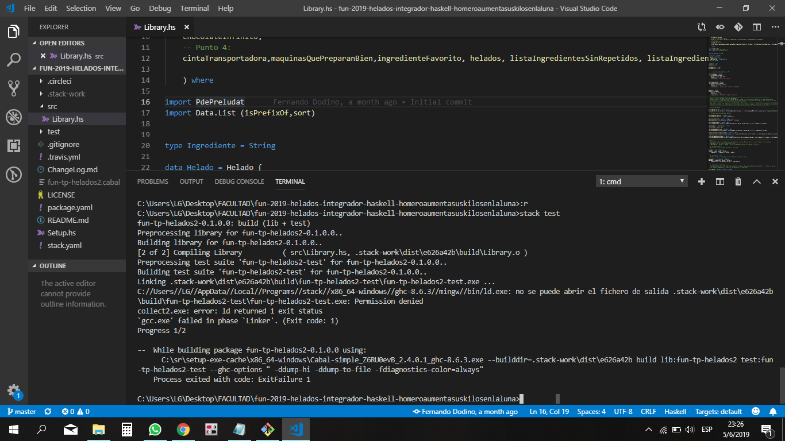

# Troubleshooting Entorno Haskell

## Stack / Haskell

### Al ejecutar el comando stack recibo un mensaje de error

Si ejecutás este comando

```bash
stack new proyecto-test https://github.com/10Pines/pdepreludat/releases/download/2.0.1/pdepreludat.hsfiles
```

y recibís un mensaje de error, revisá la versión de stack que tenés instalada (siempre en la consola o en el Git Bash).

```bash
stack --version
```

Deberías ver la versión 2.1.3 ó superior, si tenés una versión anterior ejecutá el siguiente comando:

```bash
stack upgrade
```

De esta manera tendrás la última versión de stack instalada en tu máquina.

### Permission denied al ejecutar un comando stack en Windows

Si al intentar ejecutar `stack build`, `stack test` o cualquier otro comando stack te aparece un mensaje de error del tipo `Permission denied`



- **revisá que no tengas caracteres especiales en el path de tu proyecto.** Por ejemplo (espacios, eñes, °, tildes, &, etc.). 

- **revisá si está corriendo de fondo tu antivirus de Windows**, si es así deshabilitalo o configurá para que no haga chequeos en la carpeta donde tenés tus proyectos Haskell.

> El antivirus también puede causar que el comando stack build/test tarde (porque analiza los archivos que genera stack). Lo recomendable es desactivarlo al menos para la carpeta del proyecto donde estés.


### Problemas con Windows de 32 bits

Si al intentar ejecutar `stack build`, `stack test` o cualquier otro comando stack te aparece un mensaje de error que dice:

```
No setup information found for ghc-x.x.x on your plarform.
This probably means a GHC bindist has not yet been added for OS key 'windows32'.
```

Puede que la versión de GHC que se encuentra configurada en el proyecto no sea compatible con tu sistema operativo. Para solucionarlo hay que cambiar el `resolver` del archivo `stack.yaml`:

```
resolver: lts-14.20
```

Guardar el archivo y volver a ejecutar cualquier comando de `stack` para que que baje la versión de GHC correcta.

> De todas formas, recomendamos actualizar el sistema operativo por uno de 64 bits.
