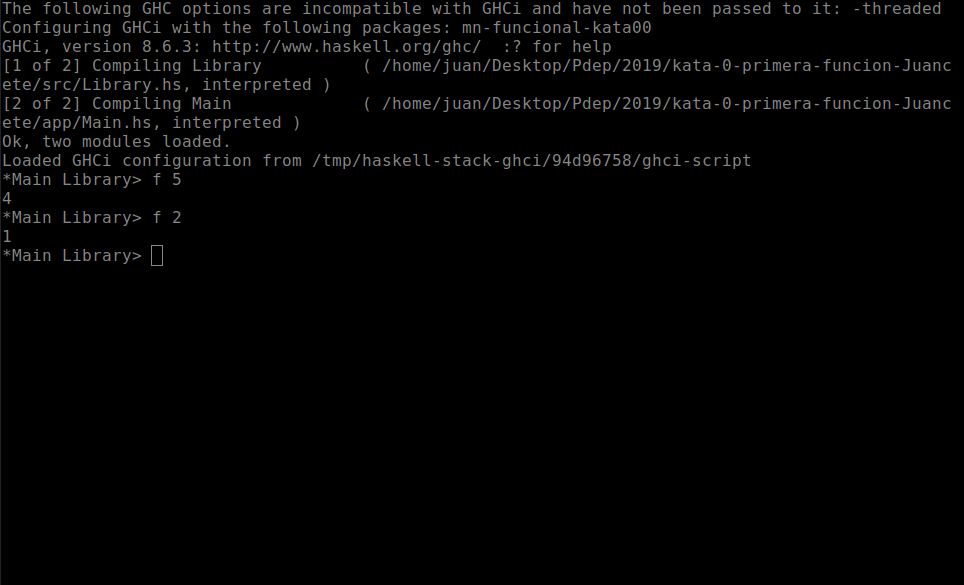
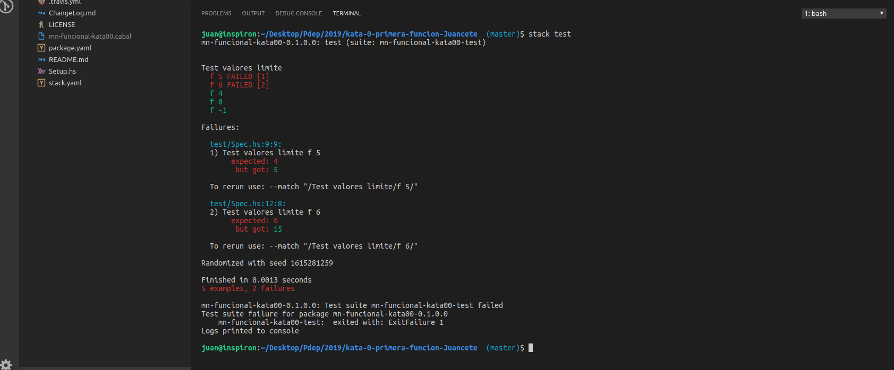

# Ejcución de un Kata

## Entrar al link de github classroom

En primer lugar tenemos que acceder al link del assignment en GitHub para la kata en cuestión que nos provee el docente. Para ello tenemos que encontrarnos logueados en el sitio. Nos aparecerá una pantalla de creación de un repositorio sobre el cual vamos a trabajar. 


Una vez que termina el proceso nos va a brindar un link del repositorio que nos pertenece para resolver la Kata. 


## Clonar el repositorio

Ya tenemos nuestro repositorio remoto con una serie de archivos y carpetas generadas que nos da la estructura de un proyecto Stack. A la derecha de nuestra pantalla tenemos un botón verde que dice **Clone or download**. Al presionarlo nos levanta un pequeño popup con un link a una pagina de GitHub finalizada en _.git_


copiamos ese vínculo y procedemos desde un [terminal o GitBash](https://git-scm.com/downloads) a clonar el repositorio mediante el comando **git clone** seguido de la URL copiada. Por ejemplo

```bash
git clone https://github.com/pdep-utn/kata-0-primera-funcion-Juancete.git
``` 


## Editar en Visual Studio Code

Para poder editar el código necesitamos tener instalado el [entorno de Haskell](./entorno-haskell.md). Una vez que abrimos el Visual Studio Code (VSCode), con el shortcut _ctrl + k + o_ podemos abrir una carpeta. Seleccionamos la carpeta donde clonamos nuestro repositorio. Ahora tenemos que trabajar en el archivo **Library.hs** de la capeta **src**


## Probar manualmente el ejemplo

Tenemos la posibilidad de abrir un terminal del sistema operativo dentro de VSCode yendo a al menú _Terminal -> nuevo terminal_, o bien abrir un temrinal nativo del sistema. Allí podremos llamar a nuestro intérprete de Haskell (Ghci) mediante el comando

```bash
stack ghci
```

Y podemos jugar con nuestra función/es desarrolladas



Para poder salir del intérprete Haskell solamente es necesario ingresar el comando **:q**

## Pruebas automatizadas

Para correr los tests automatzados es necesario correr desde el terminal el siguiente comando:

```bash
stack test
``` 


Aquí podemos ver de forma visual si nuestro desarrollo cumple con los requisitos esperados que fueron modelados mediante una batería de tests. Como se puede ver en la imágen anterior al estar todos los tests en verde tenemos la seguridad que la funcionalidad es correcta. En caso de tener un error nos muestra detalladamente cual es la falla:



## Subir la Kata resuelta

Una vez finalizada la resolución de la Kata y si pasaron todos los tests correctamente, procedemos mediante el siguientes comandos:

* subir al repositorio local

```bash 
git add .
git commit -m "Kata xx resuelta"
```

* Subir al repositorio remoto

```
git push origin master
```  
