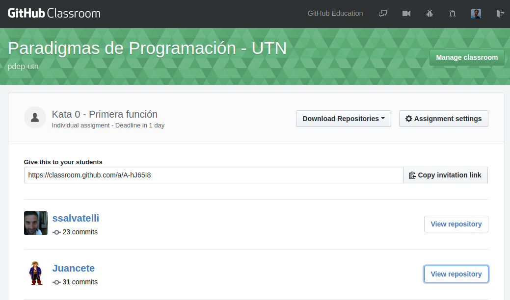
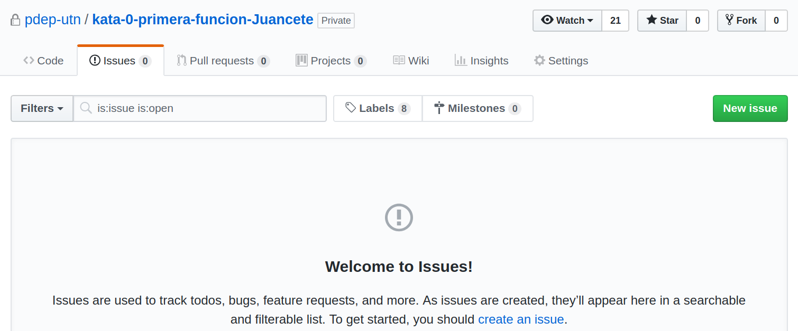

# Guía para la corrección de Katas - miércoles a la noche

## Compañero tutor

Primero, revisá cuál es tu compañero tutor en [la lista de buena fe](https://docs.google.com/spreadsheets/d/1-sVFvdMYr9UjH5MtDp_jsByGFysUzp4NUb5CshxSLWY/edit#gid=1959572195), y ponete de acuerdo quién y cómo van a corregir. Lo ideal es que

- uno haga la corrección
- y otro lo revise
- lo miren juntos, y después cuando terminen les mandan un mail a los chicos con el link al issue o bien taggean a los dos usuario de github cuando terminen la corrección: ej. `@fdodino @Juancete`

## Conocer tus grupos

En la planilla del curso [K2052](https://drive.google.com/open?id=1h3zS_0IiAgVzw2p-A2X4dVUgVcDozZVXQXGN4hES3Qg) o [K2152](https://drive.google.com/open?id=1jRJOhhPgLrPJniDmLZSvspT36MKfA8WwAs0SEI1Rb7M), buscate en la columna D a ver qué grupos te tocan. Vas a reconocerlos porque tendrán la descripción del número de grupo corrector que tenés. Ej: `1 - JuanC/Diego`.

> Fundamental: si no vas a poder corregir, hablalo con tu backup. Si ninguno de los dos puede corregir esta kata, avisale a Juan/Dodain, para que activen la guardia de emergencia.

## Ingresar a los repos

En [github classroom](https://classroom.github.com/classrooms/8278072-paradigmas-de-programacion-utn), deberías ingresar a la Kata que corresponda, por ejemplo [la kata 0](https://classroom.github.com/classrooms/8278072-paradigmas-de-programacion-utn/assignments/kata-0-primera-funcion) y esa página te va a abrir todos los repositorios. Ingresá únicamente a los repos de los tutoreados que están en la planilla, hay que identificarlos por la columna C (usuario github) del curso. Como el TP es individual, cualquiera de los dos integrantes puede haber subido a su repo la solución.



Para entrar al repo, hay que hacer click en `View Repository`.

> **Importante**: si entrás directamente al repositorio de Github, puede que veas commits posteriores al vencimiento de la kata, mientras que en Github Classroom solo permite que los alumnos hagan push mientras que el assignment no está vencido.

## Primer control: badge y build manual

Si tiene badge, deberíamos ver un `Passed` o un `Failed` del CI. Lo que sigue es descargarse el repo y correr los tests automatizados. Para Haskell esto es:

```bash
git clone https://github.com/pdep-utn/repositorioDelAlumno
stack build intero
stack test
```

Deberían pasar los tests. Y en el README deberían tener el o los dos integrantes.

## Corrección del código

En un segundo paso, hay que mirar en la carpeta `src` el archivo `Library.hs` (y por las dudas el test, por si lo cambiaron). Anotan las correcciones generales:

- nombre de las variables
- abstracciones utilizadas
- utilización de los conceptos que pide el enunciado
- evitar repetición de código
- etc.

## Nuevo issue

La mejor forma de dejar la corrección en la kata es asociarle un issue, para lo cual van a la solapa issues (`url del repo/issues`), y hacen click sobre `New issue`:



En el issue publican toda la corrección, incluyendo si lo quieren soluciones alternativas. Su compañero tutor lo puede revisar y ajustar.

Algunos tips:

- Para entremezclar código, está bueno utilizar los acentos graves con el sufijo haskell (\`\`\`haskell), para activar el coloreado de sintaxis (de lo contario quedará todo en negro)
- No utilicen tablas, suelen ser complicadas y molestan para insertar código
- Cualquier duda, apóyense con [el link al markdown cheatsheet](https://github.com/adam-p/markdown-here/wiki/Markdown-Cheatsheet)

El issue no se cierra, simplemente queda como evidencia de que fue corregido y el alumno puede iniciar una conversación dentro del issue para despejar dudas.

Recuerden ponerse de acuerdo sobre la forma en que van a comunicar la corrección a los alumnos (tags en el issue o mail).

## Pasar la nota a la planilla

Una vez pasada la nota a la planilla, ponen un 0, 1, 2 (ó 3 cuando haya puntos BONUS). En caso de dudas, escriben a la lista de profesores.