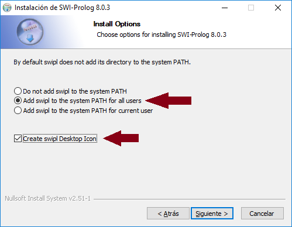
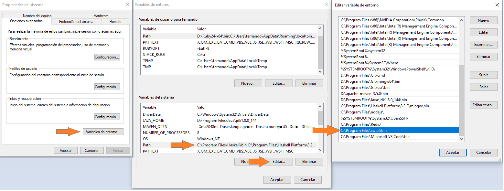
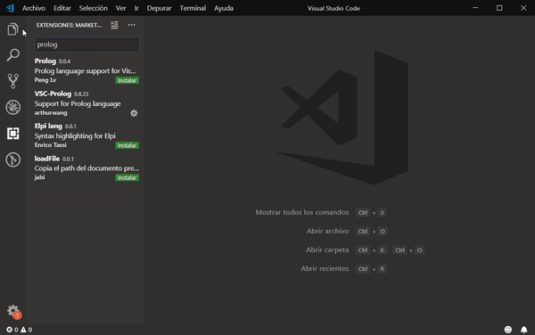
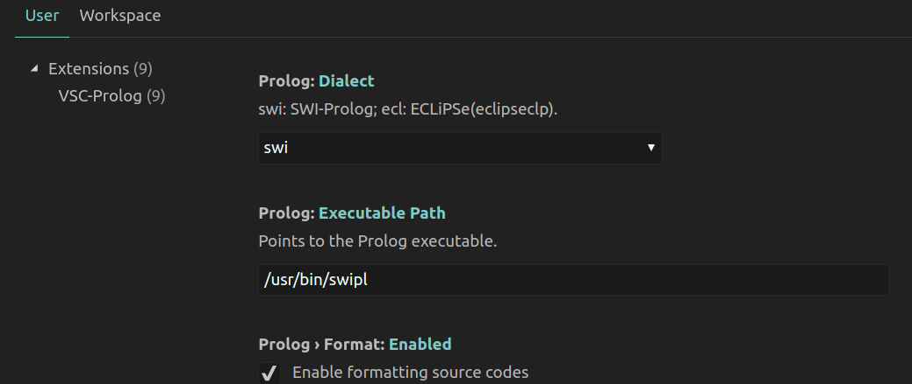
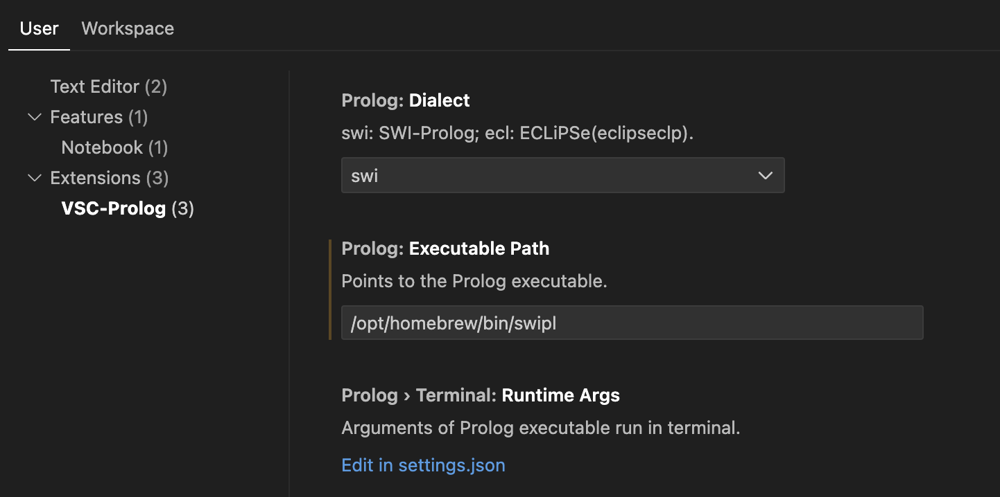
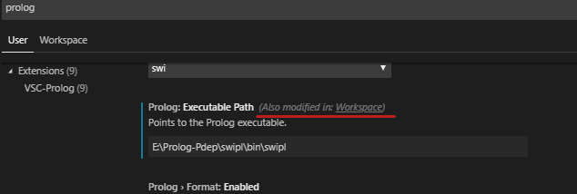

# Instalación y configuración del entorno Prolog

Esta página te ayudará a instalar y configurar el entorno Prolog para realizar todas las prácticas del **paradigma lógico** para los cursos del miércoles a la noche.

## Ejecutable Prolog

El entorno ejecutable SWI Prolog se descarga desde este link: [https://www.swi-prolog.org/download/stable](https://www.swi-prolog.org/download/stable). Si estás en Mac podés instalarlo con brew: `brew install swi-prolog`.

> **IMPORTANTE**: que sea la versión 7.6 ó posterior para que se integre con Visual Studio Code

> Acordate que debe respetar el sistema operativo en el que estás (sea de 32 ó 64 bits)

- incorporen a la variable PATH del entorno del sistema operativo. Esto lo pueden hacer de dos maneras: en el instalador seleccionan la opción para que lo incorpore automáticamente al PATH (además de crear un ícono de escritorio)



en algunos casos pueden aparecer Warnings como `Path too long`, entonces lo configuran manualmente: por ejemplo, el ejecutable que está en `C:\Program Files\swipl\bin`. Te dejemos [este link de muestra](https://www.computerhope.com/issues/ch000549.htm)



El ejecutable en Prolog será

- `swipl nombreDeArchivo.pl` si estás en Windows/Mac
- `prolog nombreDeArchivo.pl` si estás en Linux 

Asegurate que te lo reconozca en cualquier directorio donde te pares o vas a tener una mala experiencia con Prolog.

## Editor de texto

Existen [muchas opciones](https://wiki.haskell.org/IDEs), nosotros elegimos [Visual Studio Code](https://code.visualstudio.com/)

### Plugins adicionales

Para mejorar nuestra experiencia de Haskell con Visual Studio Code, se deben instalar los siguientes plugins:

- **New-VSC-Prolog**, de AmauryRabouan
- **Pure Prolog Language Support**, de hargettp
- y **Prolog Tester**, de Sky Dev, que te permitirá ejecutar los tests directamente desde el IDE

> Una recomendación que hacemos es que te armes un perfil (profile) específico para Prolog. Te dejamos [un explicación en este video](https://www.youtube.com/watch?v=_2F2Zt-_tUA), [un tutorial en inglés](https://www.youtube.com/watch?v=QjvvqR9KyVo) y [la documentación oficial de Visual Studio Code](https://code.visualstudio.com/docs/editor/profiles)

Si no lo instalaste previamente o si estás usando un profile nuevo, recomendamos que incorpores a la lista de plugins

- **Markdown All in One**, para leer los enunciados con el formato [Markdown](https://help.github.com/articles/basic-writing-and-formatting-syntax/)
- **GitLens**, para integrar Git con Visual Studio

### Configuración adicional para Windows

Si estás en Windows o Mac probablemente el plugin no encuentre el ejecutable donde está SWI Prolog para compilarlo y mostrarte errores en el código. Si es así, en la configuración sobreescribí el valor por defecto de "Prolog: **Executable Path**" modificándolo a este valor

```json
C:\Program Files\swipl\bin\swipl
```

o donde hayas instalado SWI Prolog (en mi caso lo instalé en C:\Program Files\swipl, eso genera una carpeta bin donde está el ejecutable `swipl.exe`). Si tu default es `C:\Program Files\pl`, fijate si no instalaste la versión 6 que no funciona con el plugin de Visual Studio Code.



Si te aparece un mensaje `Cannot lint the prolog file. The Prolog executable was not found. Use the 'prolog.executablePath' setting to configure` es que el path que le definiste no es el correcto, podés verificar dónde lo tenés ejecutando

```bash
where swipl
```

### Configuración de Linux

En Linux debés apuntar con la barra común adonde esté instalado SWI Prolog (por defecto funciona ok):



Podés verificar dónde está instalado ejecutando

```bash
whereis swipl
which swipl
```

### Configuración de Mac

Si instalaste Prolog con brew, el ejecutable probablemente se encuentre en `/opt/homebrew/bin/swipl`:



Para confirmarlo podés ejecutar

```bash
whereis swipl
```

## Cómo trabajar en el entorno

Podés levantar Prolog por afuera del Visual Studio Code o bien abrir una terminal y escribir

```bash
swipl nombreDelArchivo.pl  // por ejemplo, Solucion03.pl
```

Esto levantará el archivo y ejecutará los tests, que también podés correr haciendo

```prolog
? run_tests.  % siempre es importante el punto final
```

Para salir de Prolog

```prolog
? halt.
```

Y cuando hagas cambios en Visual Studio Code, para refrescar los tests debés correr

```prolog
? make.
```

Lo mismo podés hacerlo en la ventana Prolog, a partir de los comandos `Consult...` (abre un archivo Prolog nuevo), `Reload modified files` (es el make) o `Edit` (levanta el editor de texto de Prolog)

## Troubleshooting

### Undefined procedures?

Asegurate que cuando definas un tests todos los predicados existan, aunque fallen, porque si no vas a experimentar problemas raros como:

- tests que no pasan pero que cuando los evaluás en la consola funcionan satisfactoriamente
- predicados que dicen que no existen:

```bash
ERROR: d:/workspaces/prolog-2019/kata-2-logico-fdodino/solucion02.pl:31:
        test pedidoZarpado: received error: plunit_delivery:'unit body'/2: Undefined procedure: plunit_delivery:pedidoZarpado/1
  However, there are definitions for:
        pedidoZarpado/1
```

La otra forma de resolverlo cuando pasa eso es **salir con halt/0 y luego levantar SWI Prolog**.

### Caracteres "especiales" (ñ, tildes)

Como de costumbre, los caracteres "extras" no son tenidos en cuenta y si querés hacer

```prolog
suelda(caño(plomo), hebe).
```

puede que en algunos entornos (como Windows) tengas inconvenientes. En ese caso si bien podés incorporar al comienzo [la directiva que define el _encoding_ utf-8](https://www.swi-prolog.org/pldoc/man?predicate=encoding/1) eso puede deshabilitar los controles del plugin de Prolog, así que **te recomendamos que evites caracteres especiales**.

### Cada vez que escribo o borro un caracter en VSC se me abre una ventana de SWI Prolog

Si te pasa eso fijate que en la configuración de Visual Studio Code no estés apuntando al ejecutable `swipl-win`. Si es así modificalo a `swipl`.

> **Atención que podés tener configuraciones para cada workspace o espacio de trabajo**. Si es así, Visual Studio Code te va a mostrar un mensaje: `Also modified in: Workspace` como muestra la imagen de abajo. En ese caso, dale click al link y modificalo ahí también.



## Otras variantes

### Prolog Online para salir del paso

Si necesitás hacer pruebas rápidas en tu celular, o tablet, o en el trabajo donde no te dejan instalar nada, utilizalo online mediante la página [SWISH](https://swish.swi-prolog.org/). Pero para las _katas_ o bien para el _trabajo práctico_, te dejamos el entorno recomendado.

### ¡Prolog en Android!

Gracias a Lucas Cornero que mandó este mail, pudimos comprobar que Prolog también funciona en dispositivos móviles:

> Hola. Estuve navegando en la pagina de SWI-Prolog y vi que se podía instalar en Android . Me llamo la atención  y lo instale. Lo estuve probando y vas bastante bien se pueden hacer pruebas, cargar programas, probar los test, etc. Lo único que malo que tiene es que cuando se hace make saltan unos mensajes de warning que no hay darle bola. Esta opción de instalar SWI-Prolog y Git en el celular me pareció útil para cuando estamos viajando o la compu falla por algún motivo y necesitamos practicar o subir código sin la necesidad de tener la computadora. Dejé todo documentado en un repositorio que hice por si alguien quiere probarlo también.

https://github.com/luk-s12/Swi-prolog-y-Git-en-Android

