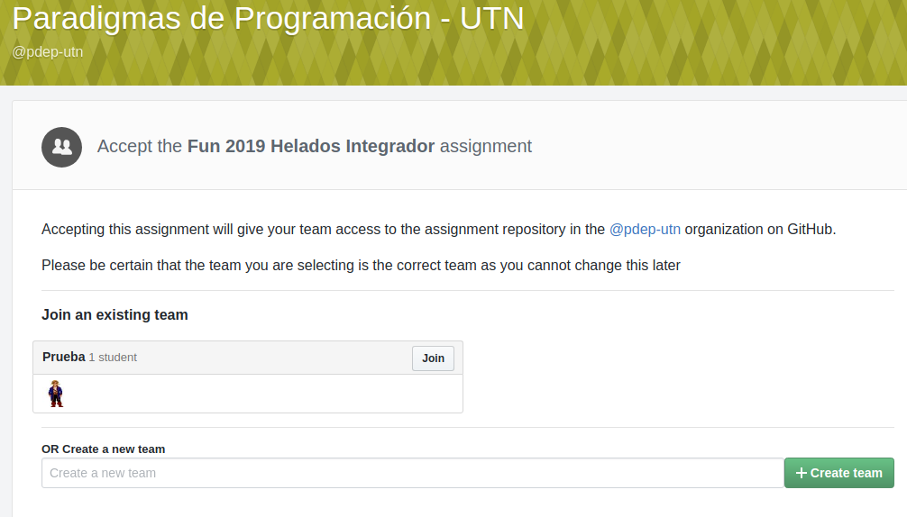

# Cómo trabajar en un assignment grupal

Una vez que tengas el link, ingresás a github classroom

Tenés dos opciones

- creás un grupo vos, con el nombre que quieras (siempre respetando a los demás). Presionás el botón `Create team`
- o bien te unís (_join_) a un grupo existente

Hablen con su compañer@ para no crear dos grupos iguales porque cualquier cambio necesitarás a un tutor para que lo haga.

## Actualización de la planilla

Para poder asignarte un tutor, tenés que ingresar a la planilla de tu curso

- [K2052](https://docs.google.com/spreadsheets/d/1h3zS_0IiAgVzw2p-A2X4dVUgVcDozZVXQXGN4hES3Qg/edit)
- [K2152](https://docs.google.com/spreadsheets/d/1jRJOhhPgLrPJniDmLZSvspT36MKfA8WwAs0SEI1Rb7M/edit#gid=0)

y en la columna F escriben el nombre de tu grupo en tu fila y la de tu compañer@.

